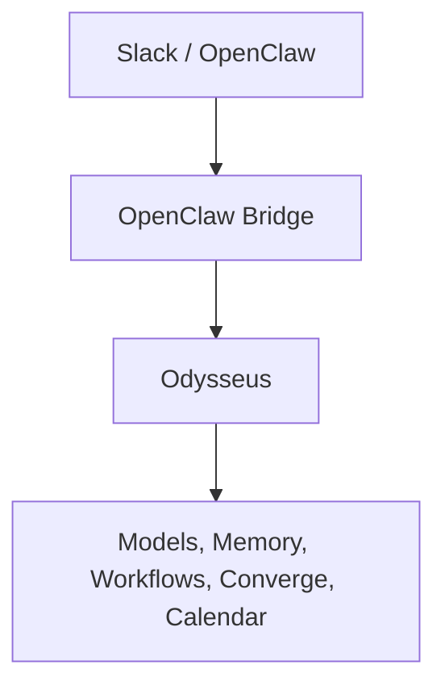

# OpenClaw Bridge

## Purpose

The OpenClaw bridge allows external clients (OpenClaw, Slack bots, scripts, automation platforms) to interact with Odysseus through a scoped API.

Odysseus remains the system of record for:
- Chat sessions
- Memory
- Converge/Redmine access
- Scheduled workflows
- Calendar event synchronization
- Research
- Tool execution

OpenClaw acts as a client/UI layer.



## Design Goals

- Local-first
- Least privilege
- Explicit scope-based access
- Safe workflow triggering
- Slack thread ↔ Odysseus session mapping
- Read-only by default

## Environment Variables

Configure the following environment variables in your `.env` file to enable Converge and Workflow integrations:

- `CONVERGE_BASE_URL`: The base URL of the Converge/Redmine Dashboard instance (e.g., `http://redmine-dashboard:3000`).
- `CONVERGE_API_KEY`: The API key for Converge. **This key should be read-only in Converge** (configured in Converge's `EXTERNAL_API_KEYS`).
- `CONVERGE_BEARER_TOKEN`: Optional Bearer token (`mrt_…`) for Converge write operations (e.g., ticket creation via `/api/issues/local`). Minted from Converge UI at `POST /api/mobile/tokens`. Unlike `CONVERGE_API_KEY` (read-only, x-api-key), this authenticates as a real user and can create/update resources.
- `OPENCLAW_ALLOWED_WORKFLOWS`: Controls which scheduled workflows can be triggered. See the Workflow Allowlist section below.
- `MAC_FOCUS_STATE_FILE`: Optional override for Mac DND state persistence (default: `~/.openclaw/state/mac_focus.json`).

## Session Mapping

Slack conversations are mapped into deterministic Odysseus sessions.

**Format:** `openclaw:slack:<channel>:<thread>`

**Examples:**
- `openclaw:slack:C123456:1700000000.000100`
- `openclaw:slack:ops-alerts:root`

This allows OpenClaw to maintain conversation continuity across Slack threads.

## Authentication

The bridge supports API token authentication.

**Example:**
```http
Authorization: Bearer <token>
```

Token ownership determines the Odysseus user context used for requests.

### Pre-Configured Token Profiles

Tokens created in **Settings → API Tokens** can be configured using built-in profiles:

| Profile | Included Scopes | Typical Client |
|---|---|---|
| **`openclaw_bridge`** | `chat`, `converge:read`, `converge:write`, `email:read`, `homelab:read`, `events:read`, `events:write`, `events:ack`, `events:resolve`, `n8n:read`, `n8n:events`, `mac:control` | OpenClaw agent, Slack bot |
| **`converge_bridge`** | `calendar:read` | Converge / Redmine Dashboard (SHA-172 timelog correlation) |
| **`codex_todos`** | `todos:read`, `todos:write` | External task sync integrations |
| **`codex_documents`** | `documents:read`, `documents:write` | Document indexers and external sync |
| **`codex_email_drafts`** | `email:read`, `email:draft`, `documents:read`, `documents:write` | Email triage bots and drafting assistants |
| **`chat`** | `chat` | Minimal conversational client |

## Scopes Reference

### Core & Chat
- **`chat`**: Basic bridge access. Allows session creation and `POST /api/openclaw/ask`.
- **`web:read`**: Allows web retrieval during chat requests (`"use_web": true`).
- **`research:run`**: Allows Deep Research execution during chat (`"use_research": true`).
- **`tools:use`**: Allows tool preprocessing and tool execution.

### Memory
- **`memory:read`**: Allows memory retrieval during chat. Without this scope, `no_memory=True` is enforced.
- **`memory:write`**: Allows memory mutation commands (`/remember`, `/forget`). Implicitly grants `memory:read`.

### Converge & Tickets
- **`converge:read`**: Read access to Converge tickets, digests, and Streamline digest (`/api/openclaw/converge/*`, `/tickets/*`, `/streamline/digest`).
- **`converge:write`**: Mutating Converge actions: drafting/submitting tickets from email triage and triggering Streamline sync (`/streamline/sync`, `/inbox/triage/{id}/redmine-ticket/*`).

### Calendar
- **`calendar:read`**: Allows querying normalized calendar events via `/api/converge/calendar/events` (used for SHA-172 employee timelog correlation).
- **`calendar:write`**: Allows creating or modifying calendar events and triggers calendar sync.

### Email & Inbox
- **`email:read`**: Allows reading triage items from the email urgency scanner (`/api/openclaw/inbox/triage/*`).
- **`email:draft`**: Allows creating draft emails via the assistant.
- **`email:send`**: Allows dispatching outgoing emails.

### Homelab & Events
- **`homelab:read`**: Allows homelab service registry inspection and non-mutating health checks (`/api/openclaw/homelab/health`, `/services`).
- **`homelab:write`**: Allows mutating homelab state, such as container restarts (`POST /api/openclaw/homelab/ops/docker-restart`). Must be explicitly granted; not included in `openclaw_bridge`.
- **`events:read`**: Allows listing and querying durable homelab events (`/api/openclaw/homelab/events`).
- **`events:write`**: Allows recording incoming alerts or health failures as durable events (`/health/record`, `/incidents/record`).
- **`events:ack`**: Allows acknowledging or marking events as investigating.
- **`events:resolve`**: Allows resolving or ignoring events.

### n8n
- **`n8n:read`**: Read access to n8n workflow health and execution failures (`/api/openclaw/n8n/health`, `/failures`).
- **`n8n:events`**: Allows recording failed n8n executions into the Odysseus Event Store (`/failures/record`).
- **`n8n:write`**: Mutating n8n operations, such as triggering or pausing workflows. Must be explicitly granted; not included in `openclaw_bridge`.

### Mac Automation
- **`mac:control`**: Allows macOS Focus mode / Do Not Disturb toggles, morning standup shortcut triggers, and deployment triggers (`/api/openclaw/mac/*`).

## Workflow Allowlist

Workflow execution can be restricted using the `OPENCLAW_ALLOWED_WORKFLOWS` environment variable:

- **Comma-separated values**: Restricts execution to specific workflow names or IDs (e.g. `OPENCLAW_ALLOWED_WORKFLOWS=daily-summary,redmine-triage`).
- `*`: Allows all workflows.
- **Empty**: Disables allowlist enforcement completely, relying solely on scope checks.

## Routes & Examples

### Health & Core

#### `GET /api/openclaw/health`
Basic bridge health. Does not perform Converge smoke checks.
```bash
curl -H "Authorization: Bearer <token>" http://localhost:7000/api/openclaw/health
```

#### `POST /api/openclaw/ask`
Chat completion using bridge session mapping. **Requires:** `chat`
```bash
curl -X POST -H "Authorization: Bearer <token>" -H "Content-Type: application/json" \
  -d '{"message": "What is the status of our services?", "session_id": "openclaw:slack:C123:root"}' \
  http://localhost:7000/api/openclaw/ask
```

---

### Converge Calendar Bridge (SHA-172)

#### `GET /api/converge/calendar/events`
Returns normalized calendar events for a date window across all accounts connected to the token owner's account (used for correlating employee timesheets and Redmine activity). **Requires:** `calendar:read` or `calendar:write` (included in `converge_bridge` profile). **Query Parameters:**
- `start`: ISO 8601 timestamp (e.g. `2026-09-01T00:00:00Z`)
- `end`: ISO 8601 timestamp (e.g. `2026-09-07T23:59:59Z`)

```bash
curl -H "Authorization: Bearer <token>" \
  "http://localhost:7000/api/converge/calendar/events?start=2026-09-01T00:00:00Z&end=2026-09-07T23:59:59Z"
```

---

### OpenClaw Inbox Triage & Redmine Ticket Submission

#### `GET /api/openclaw/inbox/triage`
List active email triage candidates from the urgency scanner. **Requires:** `email:read`
```bash
curl -H "Authorization: Bearer <token>" http://localhost:7000/api/openclaw/inbox/triage
```

#### `POST /api/openclaw/inbox/triage/{item_id}/ack`
Acknowledge an inbox item in triage. **Requires:** `email:read`
```bash
curl -X POST -H "Authorization: Bearer <token>" \
  http://localhost:7000/api/openclaw/inbox/triage/<item_id>/ack
```

#### `POST /api/openclaw/inbox/triage/{item_id}/mute-sender`
Mute future triage candidates from the email sender. **Requires:** `email:read`
```bash
curl -X POST -H "Authorization: Bearer <token>" \
  http://localhost:7000/api/openclaw/inbox/triage/<item_id>/mute-sender
```

#### `GET /api/openclaw/inbox/triage/{item_id}/summary`
Get a compact summary of an inbox triage email. **Requires:** `email:read`
```bash
curl -H "Authorization: Bearer <token>" \
  http://localhost:7000/api/openclaw/inbox/triage/<item_id>/summary
```

#### `POST /api/openclaw/inbox/triage/{item_id}/redmine-ticket/draft`
Generate a Redmine ticket payload proposal from an urgent email item. **Requires:** `email:read` + `converge:write`
```bash
curl -X POST -H "Authorization: Bearer <token>" \
  http://localhost:7000/api/openclaw/inbox/triage/<item_id>/redmine-ticket/draft
```

#### `POST /api/openclaw/inbox/triage/{item_id}/redmine-ticket/submit`
Submit a Redmine ticket directly from an urgent email. **Requires:** `email:read` + `converge:write`

> **Validation Guard (PR #44):** If the email item is corrupted or unparseable (subject, sender, and reason/body are missing or generic placeholders), this route rejects with **HTTP 422 Unprocessable Entity**. To submit anyway, the caller must supply explicit `subject` and/or `description` fields in the request body.

```bash
curl -X POST -H "Authorization: Bearer <token>" -H "Content-Type: application/json" \
  -d '{"subject": "Manual Subject Override", "description": "Details about the incident"}' \
  http://localhost:7000/api/openclaw/inbox/triage/<item_id>/redmine-ticket/submit
```

---

### Streamline Sync

#### `GET /api/openclaw/streamline/digest`
Retrieve the Streamline log digest from the Converge external API. **Requires:** `converge:read`
```bash
curl -H "Authorization: Bearer <token>" http://localhost:7000/api/openclaw/streamline/digest
```

#### `POST /api/openclaw/streamline/sync`
Trigger a Streamline sync through Converge. **Requires:** `converge:write` and request body flag `"confirm": true`
```bash
curl -X POST -H "Authorization: Bearer <token>" -H "Content-Type: application/json" \
  -d '{"confirm": true}' \
  http://localhost:7000/api/openclaw/streamline/sync
```

---

### Mac Automation

#### `POST /api/openclaw/mac/focus`
Toggle macOS Focus / Do Not Disturb state. **Requires:** `mac:control`
```bash
curl -X POST -H "Authorization: Bearer <token>" -H "Content-Type: application/json" \
  -d '{"active": true}' \
  http://localhost:7000/api/openclaw/mac/focus
```

#### `POST /api/openclaw/mac/standup`
Execute the macOS morning standup automation shortcut. **Requires:** `mac:control`
```bash
curl -X POST -H "Authorization: Bearer <token>" http://localhost:7000/api/openclaw/mac/standup
```

#### `GET /api/openclaw/mac/status`
Read current macOS focus state and last deploy details. **Requires:** `mac:control`
```bash
curl -H "Authorization: Bearer <token>" http://localhost:7000/api/openclaw/mac/status
```

#### `POST /api/openclaw/mac/deploy`
Trigger an SSH deployment to the homelab host. **Requires:** `mac:control` and request body flag `"confirm": true`
```bash
curl -X POST -H "Authorization: Bearer <token>" -H "Content-Type: application/json" \
  -d '{"service": "odysseus", "confirm": true}' \
  http://localhost:7000/api/openclaw/mac/deploy
```

---

### Homelab Operations & Incident Assistant

#### `GET /api/openclaw/homelab/health`
Non-mutating homelab service health checks. **Requires:** `homelab:read`
```bash
curl -H "Authorization: Bearer <token>" http://localhost:7000/api/openclaw/homelab/health
```

#### `POST /api/openclaw/homelab/health/record`
Run health checks and record failures as durable events. **Requires:** `homelab:read` + `events:write`
```bash
curl -X POST -H "Authorization: Bearer <token>" http://localhost:7000/api/openclaw/homelab/health/record
```

#### `GET /api/openclaw/homelab/events`
List homelab events. Filter by status: `open`, `resolved`, `new`. **Requires:** `events:read`
```bash
curl -H "Authorization: Bearer <token>" "http://localhost:7000/api/openclaw/homelab/events?status=open&limit=10"
```

#### `POST /api/openclaw/homelab/events/{id}/ack`
Acknowledge an open event. **Requires:** `events:ack`
```bash
curl -X POST -H "Authorization: Bearer <token>" http://localhost:7000/api/openclaw/homelab/events/<id>/ack
```

#### `POST /api/openclaw/homelab/events/{id}/resolve`
Mark an event as resolved. **Requires:** `events:resolve`
```bash
curl -X POST -H "Authorization: Bearer <token>" http://localhost:7000/api/openclaw/homelab/events/<id>/resolve
```

#### `POST /api/openclaw/homelab/incidents/record`
Record an incoming alert as a durable homelab event. **Requires:** `events:write`
```bash
curl -X POST -H "Authorization: Bearer <token>" -H "Content-Type: application/json" \
  -d '{"source":"grafana","service":"immich","title":"Container down","summary":"immich is not running"}' \
  http://localhost:7000/api/openclaw/homelab/incidents/record
```

#### `GET /api/openclaw/homelab/incidents/{event_id}/diagnose`
Build a Slack-readable diagnosis from recent container logs and inspect state. **Requires:** `events:read` and `homelab:read`
```bash
curl -H "Authorization: Bearer <token>" http://localhost:7000/api/openclaw/homelab/incidents/<id>/diagnose
```

#### `POST /api/openclaw/homelab/ops/docker-restart`
Restart a homelab container (`restart_allowed: true` in registry). **Requires:** `homelab:write` and request body flag `"confirm": true`
```bash
curl -X POST -H "Authorization: Bearer <token>" -H "Content-Type: application/json" \
  -d '{"container": "nginx", "confirm": true}' \
  http://localhost:7000/api/openclaw/homelab/ops/docker-restart
```

---

## OpenClaw / Slack Command Reference

| Command | Route | Required Scope |
|---|---|---|
| `ops homelab health` | `GET /api/openclaw/homelab/health` | `homelab:read` |
| `ops homelab health --record` | `POST /api/openclaw/homelab/health/record` | `homelab:read`, `events:write` |
| `ops services` | `GET /api/openclaw/homelab/services` | `homelab:read` |
| `ops service <name>` | `GET /api/openclaw/homelab/services/{name}` | `homelab:read` |
| `ops events` | `GET /api/openclaw/homelab/events?status=open` | `events:read` |
| `ops event <id>` | `GET /api/openclaw/homelab/events/{id}` | `events:read` |
| `ops ack <id>` | `POST /api/openclaw/homelab/events/{id}/ack` | `events:ack` |
| `ops investigate <id>` | `POST /api/openclaw/homelab/events/{id}/investigate` | `events:ack` |
| `ops resolve <id>` | `POST /api/openclaw/homelab/events/{id}/resolve` | `events:resolve` |
| `ops ignore <id>` | `POST /api/openclaw/homelab/events/{id}/ignore` | `events:resolve` |
| `ops n8n health` | `GET /api/openclaw/n8n/health` | `n8n:read` |
| `ops n8n failures` | `GET /api/openclaw/n8n/failures` | `n8n:read` |
| `ops n8n failures --record` | `POST /api/openclaw/n8n/failures/record` | `n8n:events` |
| `ops daily brief` | `GET /api/openclaw/homelab/ops/daily-brief` | `homelab:read` |
| `ops inbox triage` | `GET /api/openclaw/inbox/triage` | `email:read` |
| `ops inbox ack <id>` | `POST /api/openclaw/inbox/triage/{id}/ack` | `email:read` |
| `ops inbox mute <id>` | `POST /api/openclaw/inbox/triage/{id}/mute-sender` | `email:read` |
| `ops inbox draft-ticket <id>` | `POST /api/openclaw/inbox/triage/{id}/redmine-ticket/draft` | `email:read`, `converge:write` |
| `ops inbox submit-ticket <id>` | `POST /api/openclaw/inbox/triage/{id}/redmine-ticket/submit` | `email:read`, `converge:write` |
| `ops streamline digest` | `GET /api/openclaw/streamline/digest` | `converge:read` |
| `ops streamline sync` | `POST /api/openclaw/streamline/sync` | `converge:write` |
| `ops mac focus on/off` | `POST /api/openclaw/mac/focus` | `mac:control` |
| `ops mac standup` | `POST /api/openclaw/mac/standup` | `mac:control` |
| `ops mac status` | `GET /api/openclaw/mac/status` | `mac:control` |
| `ops mac deploy` | `POST /api/openclaw/mac/deploy` | `mac:control` |
| `record incident` | `POST /api/openclaw/homelab/incidents/record` | `events:write` |
| `diagnose incident` | `GET /api/openclaw/homelab/incidents/{event_id}/diagnose` | `events:read`, `homelab:read` |
| `ops docker restart` | `POST /api/openclaw/homelab/ops/docker-restart` | `homelab:write` |
| `ops n8n rerun` | `POST /api/openclaw/n8n/ops/n8n-rerun` | `n8n:write` |
| `ops ticket` | `POST /api/openclaw/homelab/events/{event_id}/redmine-ticket` | `homelab:write` |
| `converge calendar` | `GET /api/converge/calendar/events` | `calendar:read` |

## Security Notes

The bridge enforces least-privilege scoping. Use the pre-configured token profiles:
- For OpenClaw / Slack operations: Use the **`openclaw_bridge`** profile.
- For Converge timelog correlation: Use the dedicated **`converge_bridge`** profile (`calendar:read`).
- Keep dangerous mutating scopes (`homelab:write`, `n8n:write`) ungranted unless intentionally automating infrastructure restarts.

## Testing

Bridge tests validate:
- Session ID generation
- Scope enforcement
- Memory and tool gating
- Research warnings and workflow allowlists
- Ticket sanitization and unparseable triage item rejection (HTTP 422)
- Calendar event bridge owner scoping
- Persistence failure 500 handling
- Stripping prohibited destructive actions from agent responses

Run targeted test suites using:
```bash
pytest tests/test_openclaw_bridge_routes.py tests/test_openclaw_homelab_routes.py tests/test_converge_calendar_routes.py
```
